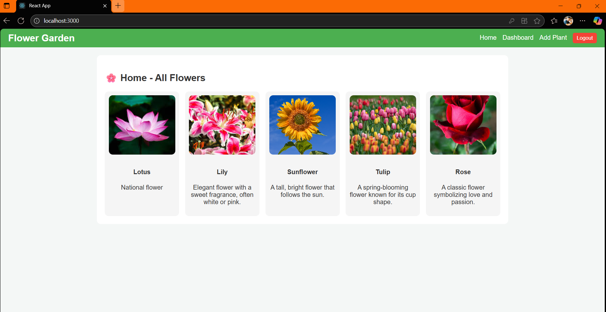

🌸 Flower Garden – MERN Stack Plant Management System
🌼 Overview

Flower Garden is a full-stack web application built with the MERN stack (MongoDB, Express.js, React.js, Node.js).
It allows users to add, view, and manage flowers or plants in a digital garden.
Users can register, log in securely, and maintain their own plant dashboard while also viewing all flowers on the public home page.

🚀 Features

🔐 User Authentication – Secure signup/login using JWT.

🌿 Add & Delete Flowers – Users can add new plants with image, name, and description.

🪴 Personal Dashboard – Displays plants added by the logged-in user.

🌷 Public Home Page – Shows all flowers from all users (sorted newest first).

⚙️ Optimized Backend – Includes Helmet, Rate Limiting, Compression, and CORS for security and performance.

💾 MongoDB Integration – Stores user and plant data efficiently.

🧠 Tech Stack
Layer	Technology
Frontend	React.js, Axios, React Router
Backend	Node.js, Express.js
Database	MongoDB (Mongoose)
Auth	JSON Web Token (JWT)
Middleware	Helmet, Morgan, CORS, Express Rate Limit, Compression

⚙️ Installation & Setup
🔧 Backend Setup
cd server
npm install
npm run dev

🌐 Frontend Setup
cd client
npm install
npm start

Default backend runs on http://localhost:5000

Default frontend runs on http://localhost:3000

👨‍💻 Author

Amandeep Singh
🌱 Built with ❤️ using the MERN stack.